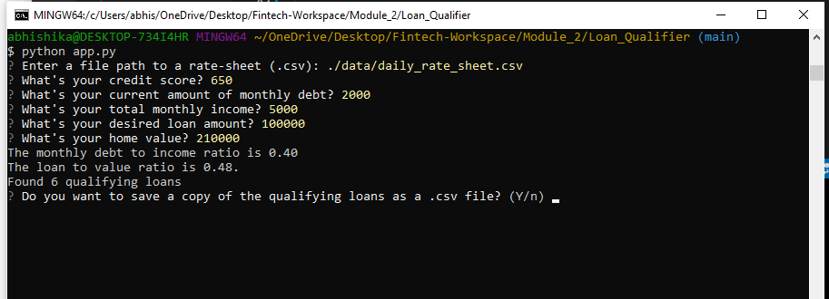
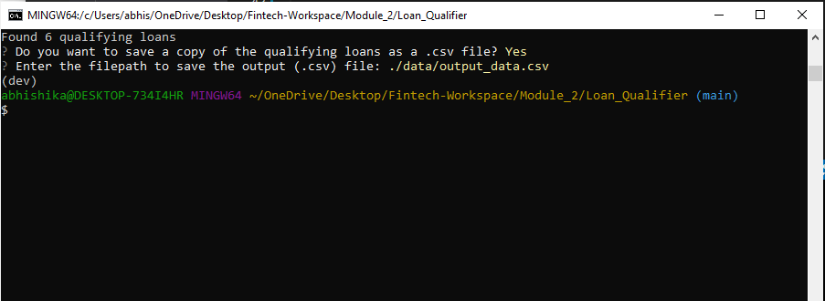
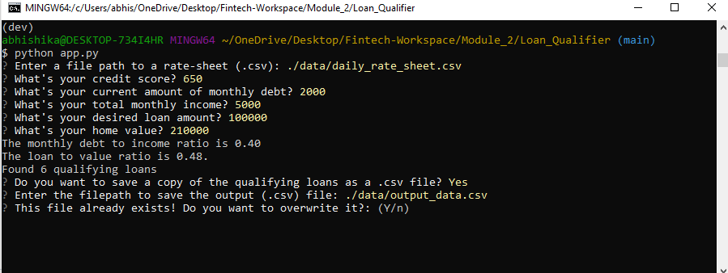

# Loan Qualifier Application

This is a python command-line interface application that allows users to input certain loan criterias and save the list of qualifying loans from lender banks into a CSV file.

The application starts by asking the user for a file in CSV format which contains the latest loan data from various loan providers. It them proceeds by asking the user a number of questions to evaluate their loan eligibility, and then save the qualifying loans to a CSV file so that the results can be shared as a spreadsheet.

---

## Technologies

The Loan Qualifier Application uses python 3.7 along with the following packages:

* [fire](https://github.com/google/python-fire) - For the command line interface, help page, and entrypoint.

* [questionary](https://github.com/tmbo/questionary) - For interactive user prompts and dialogs

---

## Installation Guide

The application uses the fire and questionary packages. Before running the application, first install these packages using the `pip` command at the command line.

```python
  pip install fire
  pip install questionary
```

---

## Usage

To use the loan qualifier application simply clone the repository and run the **app.py** at the command line with:

```python
python app.py
```

Upon launching the loan qualifier application you will be asked to enter the file path to the loan data from the lender banks. Once the file path is entered, it is verified and then the program asks for a series of financial questions regarding the users loan. **NOTE: All numerical data is assumed to be in U. S. Dollars (USD). Do not use commas or dollar signs!** 

The following image shows an example:





The app then prompts a message indicating the number of qualifying loans from the loan data file. After this the user is given the option to save this information in a csv file, to make it available to the user for sharing as a spreadsheet. If the user chooses to save the data, a prompt appears to ask the user a file path, where the data is to be saved. An example is shown below:





If the user chooses not to save the data, the program exits, wishing the user good luck. Also, if the user chooses to save the file, but does not enter any file name, the program exits giving an error. 

If the user entered file already exists, the program prompts the user to seek confirmation for overwriting the file: 





If the user enters answers no to overwriting, the program exits without saving anything. 

Another feature of the app is if the the there are no qualified loans available for the user and the user chooses to save the file, the program exits notifying the user that there are no qualified loans available, and does not save anything. 

---

## Contributors

Created by Abhishika Fatehpuria.
email: abhishika@gmail.com

---

## License

MIT
